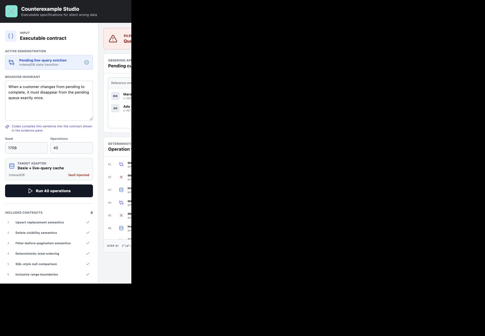
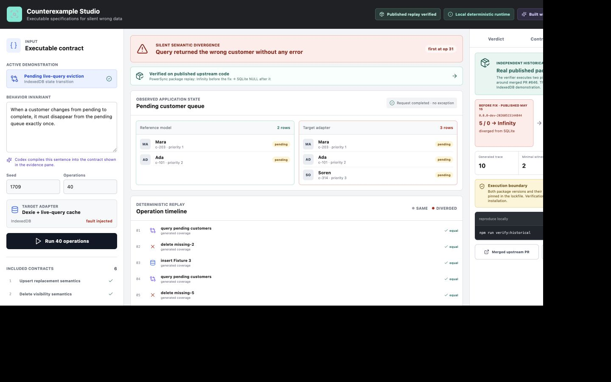
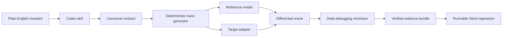

# Counterexample Studio

**Find the smallest sequence that makes a data feature silently lie.**

Counterexample Studio turns a behavioral invariant into an executable contract, compares a target adapter with a reference model, detects semantic divergence, minimizes the failing operation trace, and exports a replayable evidence bundle plus a Vitest regression.

[Launch the studio](https://sravan27.github.io/counterexample-studio/) | [Watch the 2:49 demo](https://youtu.be/Tp-_2WAuZgk)

The first demonstration is deliberately mundane and dangerous: a customer moves from `pending` to `complete`, the write succeeds, no exception is raised, but a stale live-query cache keeps the customer in the pending queue. A 40-operation run is reduced to the three operations that prove the defect.



## Verified On Published Upstream Code

The interactive cache defect is intentionally injected so the full workflow is easy to inspect. It is not the project's only proof.

An independent historical verifier imports and executes two exact, published versions of PowerSync's sync-rules package around merged [PR #646](https://github.com/powersync-ja/powersync-service/pull/646). The pre-fix package returns JavaScript `Infinity` for `5 / 0`; the post-fix package returns SQL `NULL`, matching SQLite. Counterexample Studio reduces a ten-operation differential trace to the two-operation witness and hash-binds the result.

```bash
npm run verify:historical
```

The checked-in [evidence bundle](evidence/historical/powersync-division-by-zero.json) records exact package versions, npm integrity values, source hashes, observations, minimization statistics, and its own SHA-256 digest. CI reruns this replay on every deployment.



## Why It Exists

AI can generate implementation code quickly. The hard part is knowing when code is plausibly correct but semantically wrong. Conventional tests usually encode examples after a developer already understands the failure. Counterexample Studio starts from the invariant and searches for the witness.

It produces five reviewable artifacts:

1. A canonical executable contract.
2. A deterministic generated trace with a recorded seed.
3. Reference and target observations at every step.
4. A minimized counterexample with an integrity digest.
5. A runnable regression test that preserves the witness.

## Run It

Requirements: Node.js 22.18 or newer.

```bash
npm install
npm test
npm run verify:historical
npm run build
npm run dev
```

The studio opens at `http://127.0.0.1:5173`.

Run all six deterministic contract demonstrations from the CLI:

```bash
node scripts/counterexample.mjs demo --output ./artifacts
```

Or run, minimize, verify, and export one contract:

```bash
node scripts/counterexample.mjs run \
  --contract delete-removes-visible-state \
  --output ./artifacts/delete.evidence.json

node scripts/counterexample.mjs minimize \
  --input ./artifacts/delete.evidence.json

node scripts/counterexample.mjs verify \
  --input ./artifacts/delete.evidence.min.json

node scripts/counterexample.mjs export \
  --input ./artifacts/delete.evidence.min.json \
  --output ./artifacts/delete.regression.test.ts
```

## Included Contracts

| Contract | Silent divergence under test |
| --- | --- |
| `upsert-replaces-existing` | A later write fails to replace the visible record. |
| `delete-removes-visible-state` | A deleted row remains observable. |
| `filter-before-pagination` | Pagination runs before filtering and loses valid rows. |
| `deterministic-order-ties` | Equal sort keys return unstable ordering. |
| `sql-null-comparison` | Ordinary equality incorrectly matches null. |
| `inclusive-range-boundary` | `>=` silently behaves like `>`. |

## Architecture



- `packages/core`: contract registry, adapters, differential runner, mismatch classifier, minimizer, bundle verification, and regression export.
- `scripts/counterexample.mjs`: local CLI for repeatable runs and artifacts.
- `scripts/historical-powersync-replay.mjs`: independent verifier against two exact published upstream packages.
- `apps/studio`: operational browser lab with a real IndexedDB target adapter.
- `skills/counterexample-studio`: Codex workflow for compiling invariants and interpreting bounded evidence.
- `packages/mcp`: local MCP surface over the CLI.

See [the architecture document](docs/ARCHITECTURE.md) for trust boundaries and failure behavior.

## Built With Codex And GPT-5.6

Counterexample Studio is new work created during OpenAI Build Week. Codex coordinated the product decision, implementation plan, provenance checks, integration, and QA. Parallel GPT-5.6 coding agents implemented disjoint core-engine and MCP/skill workspaces while the main rollout built the studio and judge-facing narrative. The repository preserves the division of work and commit timeline in [BUILD_PROVENANCE.md](docs/BUILD_PROVENANCE.md).

Codex is also part of the product: the included skill turns a natural-language invariant into a conservative machine-readable contract, states ambiguities explicitly, invokes deterministic tools, and never upgrades bounded evidence into a universal correctness claim.

## Public Problem Proof

This is a new product informed by a public correctness track record, not a repackaging of old code:

- Four merged PowerSync Sync Streams fixes: [#644](https://github.com/powersync-ja/powersync-service/pull/644), [#645](https://github.com/powersync-ja/powersync-service/pull/645), [#646](https://github.com/powersync-ja/powersync-service/pull/646), and [#647](https://github.com/powersync-ja/powersync-service/pull/647).
- Two merged Rocicorp Zero semantic fixes: [#6083](https://github.com/rocicorp/mono/pull/6083) and [#6088](https://github.com/rocicorp/mono/pull/6088).
- The public [silentdrop](https://github.com/sravan27/silentdrop) corpus, which documents recurring wrong-row behavior across JavaScript data engines.

The complete boundary between prior evidence and Build Week implementation is recorded in [BUILD_WEEK_SCOPE.md](BUILD_WEEK_SCOPE.md) and [CASE_STUDY.md](docs/CASE_STUDY.md).

PR #646 is also replayed as a historical verification fixture. The verifier is new Build Week code; the two public npm packages remain attributed upstream dependencies and are never presented as new implementation.

## Evidence, Not Theater

A failing bundle is a deterministic witness against the tested behavior. A passing bounded run means only that no witness was found within the recorded seed and trace bound. Counterexample Studio does not claim formal verification, universal correctness, or production safety from one generated run.

MIT licensed.
