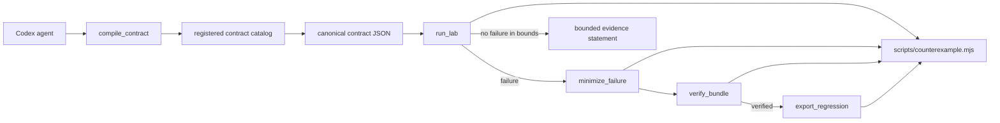

# Counterexample Studio Architecture

Counterexample Studio gives Codex a deterministic falsification loop without turning bounded test evidence into a universal correctness claim. The Codex skill defines the reasoning protocol; the local MCP server exposes the project CLI as typed tools.



## Boundaries

- `skills/counterexample-studio/SKILL.md` tells Codex how to make assumptions explicit, preserve deterministic provenance, interpret failures, and limit claims to evidence.
- `packages/mcp/src/server.mjs` defines the five public tool schemas and maps four of them to CLI commands.
- `packages/mcp/src/catalog.mjs` performs conservative deterministic matching against the six public registered contract manifests; it returns disambiguation rather than creating unsupported executable contracts.
- `packages/mcp/src/cli.mjs` is the only core integration. It invokes the documented CLI process and never imports project internals.
- `packages/mcp/src/policy.mjs` confines all trace, bundle, output, and regression paths to the plugin workspace and prevents accidental regression overwrite.
- `.mcp.json` starts the stdio server relative to the plugin root, without a machine-specific path.

## CLI process contract

For lab operations, the adapter invokes the CLI's public flags:

```text
node scripts/counterexample.mjs run --json --contract ID [--target NAME] [--seed N] [--steps N] [--trace FILE] [--output FILE]
node scripts/counterexample.mjs minimize --json --input BUNDLE [--output FILE] [--preserve kind|fingerprint]
node scripts/counterexample.mjs export --json --input BUNDLE --output TEST.ts [export options]
node scripts/counterexample.mjs verify --json --input BUNDLE
```

The CLI emits exactly one JSON value on stdout and writes diagnostics to stderr. Exit code `2` from `run` is a valid bounded pass (`match: true`); other non-zero exits are failures. `compile_contract` is read-only and maps plain English only to the public registered contract catalog because the CLI executes registered contract IDs rather than arbitrary manifests. This keeps compilation deterministic and prevents unsupported prose from masquerading as executable coverage.

The server starts the CLI with an argument array and `shell: false`. `COUNTEREXAMPLE_STUDIO_ROOT` and `COUNTEREXAMPLE_STUDIO_CLI_PATH` support local development and isolated tests. An external CLI path is rejected unless `COUNTEREXAMPLE_STUDIO_ALLOW_EXTERNAL_CLI=1` is explicitly set.

## Tool behavior

| Tool | Local writes | Evidence meaning |
| --- | --- | --- |
| `compile_contract` | None | Selects an exact registered manifest or returns disambiguation; it does not prove intent fidelity. |
| `run_lab` | Optional result/failure bundle | Runs one registered contract ID; a pass means no counterexample was found within the recorded seed and trace bound. |
| `minimize_failure` | Minimized bundle | Preserves mismatch fingerprint by default, or mismatch kind when explicitly requested. |
| `verify_bundle` | None | Verifies digests, registered contract identity, and deterministic replay. |
| `export_regression` | Vitest regression file | Preserves one verified witness; it does not establish the universal invariant. |

Compilation and lab tools are marked non-destructive because they create new local artifacts. Regression export is non-idempotent unless the caller chooses a fresh path; overwrite defaults to false.

## Provenance and claims

A useful run preserves the compiled contract digest and the CLI's returned contract ID, target semantics, integer seed, trace length, mismatch, trace hash, bundle ID, and output path. The evidence bundle records the full contract manifest, original and minimized traces, reference-versus-target observations, mismatch fingerprints, and its own SHA-256 integrity digest. The integration does not invent tool-version or generator-version fields that the bundle schema does not contain.

The integration deliberately distinguishes four claims:

1. A compiled contract is a machine-readable interpretation.
2. A bounded pass found no witness in its recorded search space.
3. A verified failure is a deterministic witness against the tested claim.
4. A regression test covers that witness.

None of these alone proves implementation correctness beyond the recorded evidence.

## Historical verification path

The browser demonstration uses a deliberately faulty cache adapter so the entire falsification loop can run locally and visibly. A separate verifier prevents that controlled example from being mistaken for the project's only validation:

```text
exact pre-fix npm package  --\
                             differential trace -> minimizer -> hash-bound evidence
SQLite-compatible reference --/

exact post-fix npm package -> replay minimized witness -> match
```

`scripts/historical-powersync-replay.mjs` imports two exact published versions of `@powersync/service-sync-rules` around merged PowerSync PR #646. It executes the upstream division operator directly, records npm integrity values and source-file SHA-256 hashes, minimizes the failing trace with the same core engine, verifies the post-fix package against the witness, and compares the result with the checked-in evidence. `npm run verify:historical` performs no network access after dependencies are installed and runs in the Pages deployment workflow.

## Security model

The plugin assumes the local workspace and `scripts/counterexample.mjs` are trusted. Contract prose, candidate implementations, failure bundles, and generated tests are untrusted data.

The MCP server:

- performs no network requests or external actions;
- confines every input and output path to the workspace, including through existing symlink ancestors;
- invokes Node without a shell and passes only a small environment allowlist;
- caps combined stdout and stderr at 2 MiB;
- enforces timeouts between 1 second and 5 minutes;
- requires strict JSON output and converts failures into machine-readable tool errors;
- does not execute, commit, publish, or submit exported regressions.

Generated regression code must be inspected before execution because a bundle can contain adversarial values. Bundle verification establishes integrity and replay behavior, not that generated code is safe for an unrelated runtime.

## Failure behavior

Missing CLI files, malformed JSON, unexpected non-zero exits, output overflow, timeouts, path escapes, failed bundle verification, and non-replaying minimized cases fail closed. Exit code `2` is accepted only for `run`, where the CLI defines it as a bounded match. Codex must retain the last verified artifact and must not infer success from conversational context or a failed tool call.
